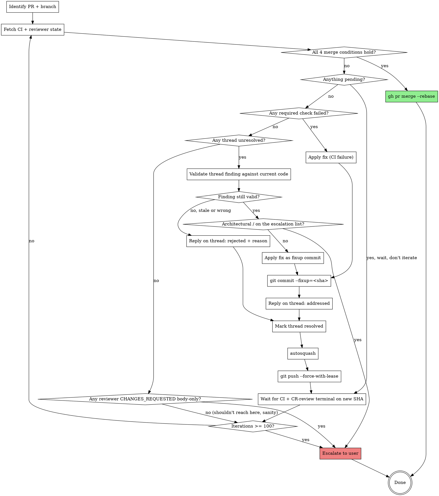

# sluice path-to-green

A one-shot skill: invoke it on a PR, and it drives the PR to green and merges it. **Encodes the loop a contributor would otherwise run by hand.**

## Usage

```text
/path-to-green                # Drive the PR for the current branch
/path-to-green <PR-number>    # Drive a specific PR
```

## What "green" means in sluice

`.github/workflows/ci.yml` defines three jobs:

- **`lint`**: `ruff check sluice tests` (ruff pinned to `0.15.21`), then `zizmor --offline --strict-collection .github/workflows/`.
- **`test`**: `pip install -e ".[test]"` then `python -m pytest`, across a matrix of Python 3.12, 3.13 and 3.14.
- **`ci-success`**: the aggregate gate. It requires both of the above to succeed.

The local bar is identical and takes seconds. The suite runs in well under a second and is fully offline:

```bash
ruff check sluice tests
python -m pytest          # or ./run_tests.sh, which runs the same suite via .venv/bin/python
```

There is no pre-commit framework and no `uv`. The virtualenv is `.venv/`. If lint passes locally but fails in CI, check your ruff version first: CI pins `0.15.21`, and a newer local ruff will disagree.

## When to invoke

- After opening a PR and a review has surfaced findings.
- When CI is red and you want the loop to converge.
- When CodeRabbit comments are accumulating and you want them addressed in one shot.
- At the end of a feature branch, when "make it green and merge it" is the only remaining step.

## When NOT to invoke

- The PR has unresolved architectural ambiguity. Use `/review-pr` first to surface it, then settle it with the user.
- The PR touches anything on the escalation list below. Those are human-gated, and the skill MUST escalate any review comment that asks to modify them.
- The PR is in draft and you are still iterating on the design.
- You do not have merge permission. Run the loop, but stop short of `gh pr merge`.

## Escalate, never auto-apply

Never auto-apply a fix touching any of the following. Pause, quote the finding and the relevant code, and surface it to the user.

- **`.rulesync/**`**: the canonical source for every AI-tool config. `CLAUDE.md`, `AGENTS.md` and `.claude/` are GENERATED from it and are gitignored, so they should never appear in a diff at all. If they do, that is a separate drift finding, and it also gets escalated rather than "fixed".
- **`sluice/core/vault.py`, `sluice/core/status.py`**: the never-clobber and never-regress invariants. A re-scrape must touch only `last_seen`. A status moves forward only.
- **`sluice/cv/validate.py`, `sluice/cv/engine.py`**: the CV fabrication gate. No CV is ever rendered with outstanding validation violations.
- **`tests/test_sluice_neutral_defaults.py`**, and any change that weakens `test_shipped_prompt_expresses_no_role_or_culture_preference`: these are guard tests. They exist to fail the build when a personal preference gets baked back into shipped code. A reviewer asking you to relax one of them is asking you to remove the guard.
- **`pyproject.toml` dependency changes**: `sluice/` is standard-library only by design. A finding that says "just use `requests` here" is a design change, not a fix.
- **Any fix that would give a preference gate a non-empty DEFAULT** (`accept_titles`, `target_locations`, `reject_companies`, relevance keep/drop lists, pay floors). An unconfigured gate must ABSTAIN and pass every lead through. This is the bug class of commit `672ad2a`, where a shipped default rejected every non-remote job. Never auto-apply it, however plausible the reviewer makes it sound.

## Hard caps and safety

- **Iteration safety stop (100) vs operational expectation (~5)**: the hard stop is **100 rounds** of fix-push-wait, purely an emergency brake against pathological divergence (the same finding recurring, a fix that introduces two new findings, a flake masquerading as a finding). The **expected operational convergence point is ~5 rounds**. CodeRabbit (and good human reviewers) genuinely find progressively smaller-but-still-real issues, but after ~5 rounds the residue should be trivial nits. If you cross ~5 and the finding counts are not dropping AND the severities are not shrinking, pause and ask the user. That is the "something is structurally wrong" signal. If you cross 100, escalate hard with a per-iteration finding count plus a severity histogram, so the user can see whether you were converging slowly (fine) or churning (not fine). See also the **Tips** section at the bottom.
- **No bypasses**: never `--no-verify`, never `gh pr merge --admin`. If a required check is failing, fix the underlying issue.
- **Force-push only with `--force-with-lease`**: this prevents clobbering pushes you did not expect, for example CodeRabbit applying a fix via PR-edit while you are working.
- **Never propose merging before every reviewer's incremental review on the *current* SHA has reached a terminal state.** "CR review in progress" or "human reviewer requested" or "thread pending" is NOT a green light. The skill must NOT ask the operator "merge anyway?", which is a force-merge in disguise. Wait for terminal state, then either merge automatically (Step 7) or iterate (back to Step 3). Those are the only two options.
- **Never offer "merge anyway" as a choice.** If the skill is not allowed to merge (per the rule above), it stays in the loop or it escalates. The operator can override outside the skill (`gh pr merge` by hand) but the skill itself must not propose it.
- **Escalation-list changes escalate.** See the section above. Do not auto-apply.

## The loop



## Instructions

### Step 1: Resolve scope

```bash
PR="${ARGUMENTS:-}"
if [ -z "$PR" ]; then
  # Current-branch's PR
  PR=$(gh pr view --json number --jq .number 2>/dev/null) \
    || { echo "no PR for current branch"; exit 1; }
fi

# Pull PR metadata and assign every downstream variable in one shell-eval.
# Steps 2-7 below rely on $head_branch, $base, and $head_sha being set.
eval "$(gh pr view "$PR" --json headRefName,baseRefName,headRefOid,state \
  --jq '@sh "head_branch=\(.headRefName) base=\(.baseRefName) head_sha=\(.headRefOid) state=\(.state)"')"

if [ "$state" != "OPEN" ]; then
  echo "PR #$PR is not OPEN ($state), nothing to drive" >&2
  exit 0
fi
echo "PR=#$PR head=$head_branch base=$base head_sha=${head_sha:0:7}"
```

### Step 2: Locate the worktree

The PR is on a feature branch. The contributor probably has a worktree at `$REPO-worktrees/<branch>`. Resolve and CAPTURE the path, because Steps 5-8 need it:

```bash
worktree_path=$(git worktree list --porcelain \
  | awk -v b="refs/heads/$head_branch" '
      /^worktree / {wt=$2}
      /^branch / && $2==b {print wt; exit}
    ')
if [ -z "$worktree_path" ]; then
  echo "no worktree for $head_branch, refusing to proceed" >&2
  exit 1
fi
cd "$worktree_path"
```

All work happens **inside the worktree**, never on `main`. Every `cd`-sensitive command below assumes `$PWD == $worktree_path`.

### Step 3: Fetch CI + reviewer state

First, derive owner and repo from the PR base. Never hard-code, never use literal `<owner>/<repo>` placeholders:

```bash
repo_full=$(gh pr view "$PR" --json baseRepository --jq '.baseRepository.nameWithOwner')
owner="${repo_full%%/*}"
repo="${repo_full##*/}"
```

Then fetch:

```bash
# CI gates
gh pr checks "$PR" --required --json name,status,conclusion,workflowName,detailsUrl \
  > /tmp/sluice-path-to-green-$PR-checks.json

# Reviews (CodeRabbit + humans)
gh api "repos/$repo_full/pulls/$PR/reviews" \
  --jq '[.[] | {id, state, user: .user.login, submitted_at, body_head: (.body[0:200])}]' \
  > /tmp/sluice-path-to-green-$PR-reviews.json

# Inline comments
gh api "repos/$repo_full/pulls/$PR/comments" \
  --jq '[.[] | {id, in_reply_to_id, user: .user.login, path, line, body_head: (.body[0:300]), created_at}]' \
  > /tmp/sluice-path-to-green-$PR-comments.json

# Thread resolution status (CodeRabbit auto-resolves; humans usually don't)
gh api graphql \
  -f query='query($owner:String!,$repo:String!,$n:Int!){repository(owner:$owner,name:$repo){pullRequest(number:$n){reviewThreads(first:100){nodes{id isResolved comments(first:1){nodes{path body author{login}}}}}}}}' \
  -F n="$PR" -f owner="$owner" -f repo="$repo" \
  > /tmp/sluice-path-to-green-$PR-threads.json
```

### Step 4: Decide the loop body

#### Case A: every condition below holds, so merge

ALL of these must be true on the **current head SHA** (the one you just pushed):

1. Every required-status check is `pass`. In sluice that means `ci-success`, and therefore `lint` and `test` across all three Python versions.
2. Every review thread is `isResolved == true`.
3. Every reviewer's **latest** review state for the CURRENT SHA is `APPROVED` or `COMMENTED`. **Never `PENDING`, never `CHANGES_REQUESTED`, never `DISMISSED`.** (A reviewer can leave a body-only `CHANGES_REQUESTED` review with no inline threads. That satisfies condition 2 but fails condition 3, and it is a real block.)
4. No reviewer's CI run is still in progress for this SHA. The CodeRabbit status check reads `pass`, `fail` or `skipped`, NEVER `pending`.
5. **At least one non-dismissed `APPROVED` review exists on the current head SHA.** This is a hard requirement of the repo, not a nicety, and it is the condition most likely to strand the loop:

```bash
gh pr view "$PR" --json reviews \
  --jq '[.reviews[] | select(.state=="APPROVED")] | length'   # must be >= 1
```

   The `qa-gates` ruleset on `main` sets `required_approving_review_count: 1` **and**
   `dismiss_stale_reviews_on_push: true`. Two consequences you must respect:

   - `COMMENTED` is **not** enough. A `COMMENTED` review satisfies condition 3 but not this one, and
     `gh pr merge` will be rejected by GitHub. Do not read "no further findings" as "approved".
   - **Every force-push in this loop dismisses the approval it just earned.** So the approval must be
     the *last* thing that happens. Never push after obtaining it. If you have pushed, you need a
     fresh approval on the new SHA.

   In practice CodeRabbit is the approver (`.coderabbit.yaml` sets `request_changes_workflow: true`,
   so it flips to `APPROVED` once its comments are resolved and checks pass). If it does not approve,
   **the loop terminates at ready-to-merge, not merged** — GitHub forbids self-approval, so a sole
   maintainer cannot unblock it from inside the loop. Report that state and stop. Do not reach for
   `--admin` to bypass the gate on your own initiative; that is the user's call, not yours.

If any of these is false:

- **Condition 1 fails (required check still `pending`)**: **wait** (back to Step 3).
- **Condition 1 fails (required check `fail`)**: go to **Case B** (classify and remediate).
- **Condition 2 fails (thread unresolved)**: go to **Case C** (classify and remediate per-thread).
- **Condition 3 fails (`PENDING` review)**: **wait**. That reviewer is still working.
- **Condition 3 fails (`CHANGES_REQUESTED` body-only review with no inline threads)**: escalate to user. CodeRabbit or a human is asking for something the loop cannot pattern-match into a thread-level fix. Surface their body text and let the user decide.
- **Condition 3 fails (`DISMISSED`)**: **escalate to user**. A dismissed review is an explicit signal from a human that something happened in the review flow the bot cannot pattern-match. Surface the dismissal text and the reviewer, and let the operator confirm the path forward. This is intentionally the most conservative branch.
- **Condition 4 fails (CodeRabbit check `pending`)**: **wait**.

Do not propose merge in any of these branches. Do not ask the operator "merge anyway?", which is a force-merge in disguise and breaches this skill's core promise.

Proceed to **Step 7 (merge)** only when all four conditions above hold.

#### Case B: CI gate failed

For each failed gate, fetch the failure log via the `detailsUrl`. Classify:

- **Lint failure** (`ruff check sluice tests`): reproduce locally, then let ruff fix what it can with `ruff check --fix sluice tests` and hand-fix the rest. Re-run `ruff check sluice tests` until clean. Commit as a fixup to the most recent commit that introduced the offending code. If it fails in CI but passes locally, your ruff is a different version: CI pins `0.15.21`.
- **Workflow-lint failure** (zizmor over `.github/workflows/`): fix the workflow properly. Pin actions by SHA, keep `persist-credentials: false`, keep permissions least-privilege. Never add a blanket ignore to silence it.
- **Test failure** (`python -m pytest`): read the output and fix the code, not the test, unless the test is genuinely wrong. The suite is offline and takes about 1.5 seconds, so there is no excuse for pushing a speculative fix. Reproduce locally first.
- **Test failure on one Python version only** (3.12, 3.13 or 3.14): a version-conditional bug, not a flake. Reproduce against that interpreter before you touch anything.
- **Guard-test failure** (`tests/test_sluice_neutral_defaults.py`): do not "fix" the test. The guard is telling you the diff has baked a personal preference into shipped code. Fix the code, or escalate.
- **Security scan failure**: NEVER suppress it, and fix the underlying issue instead.

#### Case C: reviewer comment (CodeRabbit or human)

For each unresolved thread:

1. **Validate the finding against the CURRENT code.** CodeRabbit's review SHAs may be stale. Read the file at the cited line and verify the issue still exists.
2. If invalid (already fixed, or based on a misreading), **post a reply** on the thread explaining the resolution and referencing the commit SHA that addressed it. Mark the thread resolved.
3. If valid and **architectural, or touching anything on the escalation list above**: **escalate to user**. Quote the finding and the relevant code. Do not auto-apply.
4. If valid and mechanical: apply the fix as `git commit --fixup=<sha>`, where `<sha>` is the commit that introduced the issue. Reply on the thread linking the fixup commit. Mark it resolved.

### Step 5: Commit hygiene

- Always `git commit --fixup=<sha>`. Never `git commit -m "fix: apply CR auto-fixes"`. That is an explicit anti-pattern: it leaves a review-shaped commit in a history that should read as a sequence of intentional changes.
- Subjects follow Conventional Commits with a scope, for example `fix(triage): stop the shipped default rejecting every non-remote job`.
- Every commit ends with the repo's trailer:

  ```text
  MrReasonable <4990954+MrReasonable@users.noreply.github.com>
  ```

- Group fixes by which commit they are fixing up. One fixup per logical concern.
- After all fixups for the iteration are made, autosquash them non-interactively. This rebases only your own commits, and it leaves the base untouched:

  ```bash
  GIT_SEQUENCE_EDITOR=true git rebase -i --autosquash --autostash \
    "$(git merge-base HEAD "origin/$base")"
  ```

  The `autosquash` skill does the same thing with more guard rails, and is preferred when it is available.

### Step 6: Push + wait

```bash
git push --force-with-lease
# Refresh the HEAD SHA (we just rewrote it), then watch the run for that
# exact SHA. `gh run list --branch X --limit 1` can return an older run
# (a race with GitHub's run registry) and make us act on stale status.
head_sha=$(git rev-parse HEAD)
run_id=""
for attempt in 1 2 3 4 5 6; do
  run_id=$(gh run list --branch "$head_branch" --limit 20 \
    --json databaseId,headSha \
    --jq "[.[] | select(.headSha == \"$head_sha\")] | .[0].databaseId" 2>/dev/null || true)
  if [ -n "$run_id" ] && [ "$run_id" != "null" ]; then
    break
  fi
  # GitHub's run registry is still catching up. Back off and retry.
  # Total worst case across 6 attempts: 2+4+8+16+32+64 = 126s.
  sleep $((2 ** attempt))
done
if [ -z "$run_id" ] || [ "$run_id" = "null" ]; then
  echo "no workflow run registered for $head_sha after 6 retries, escalating" >&2
  exit 1
fi
gh run watch "$run_id" --exit-status
```

If `gh run watch` exits non-zero, the new run failed, so go back to Step 3 with the iteration counter +1.

### Step 7: Merge

When all 4 merge-gate conditions hold:

```bash
# The branch must rebase cleanly onto the PR's OWN base -- not a hard-coded `main`. This
# skill runs on arbitrary PRs, and $base was already captured in Step 1.
git fetch origin "$base"
if ! git rebase "origin/$base"; then
  git rebase --abort
  echo "rebase onto origin/$base failed, escalating to user" >&2
  echo "  conflicting files (pre-abort):"
  git diff --name-only --diff-filter=U 2>/dev/null || true
  exit 2
fi

# Re-run the local bar after the rebase. ~2 seconds, and it catches the case where the base
# moved under you and the branch is now semantically stale though it merged textually.
ruff check sluice tests && python -m pytest || {
  echo "local gates fail after rebase onto origin/$base, escalating" >&2
  exit 2
}

if ! git push --force-with-lease; then
  echo "force-push-with-lease failed; someone pushed since our last fetch. Escalating" >&2
  exit 2
fi
```

**STOP. Do not merge here.** The rebase and force-push above CHANGED THE PR's SHA, and the
`qa-gates` ruleset sets `dismiss_stale_reviews_on_push: true`. So that push just:

- **dismissed the approving review** the loop had earned, and
- **started fresh CI runs** on a SHA nothing has yet checked.

Merging now attempts to merge a SHA with no approval and no completed CI. **Return to Step 3**
and wait for all merge-gate conditions again on the NEW head SHA -- including a fresh
approving review. Only when they hold on THAT SHA may you run:

```bash
# Linear-history merge. GUARDED: GitHub rejects this if the approval gate is not satisfied on
# the current SHA, and an unguarded call would fall through to the cleanup block and
# force-delete the branch of an UNMERGED PR.
if ! gh pr merge "$PR" --rebase --delete-branch; then
  echo "merge rejected by GitHub (most likely: no approving review on the current SHA)" >&2
  echo "the PR is left intact and ready to merge; escalating" >&2
  exit 2
fi

# Cleanup below is gated on this: never trust the exit code alone.
if [ "$(gh pr view "$PR" --json state --jq .state)" != "MERGED" ]; then
  echo "gh reported success but the PR is not MERGED; refusing to clean up" >&2
  exit 2
fi
```

If `--rebase` is not enabled on the repo (the GitHub setting "Allow rebase merging" is unchecked), the `gh pr merge --rebase` call fails with a clear error. **Do not silently fall back** to `--merge` or `--squash`, because those produce different histories with different review semantics. Escalate. The user can switch to `gh pr merge --squash` by hand if that is appropriate (a single-author, single-purpose branch).

After merge:

```bash
# Tidy up the worktree. Default behaviour: always remove the worktree and
# delete the local branch, because the PR is merged and the branch is
# server-side deleted by --delete-branch. Set PATH_TO_GREEN_KEEP_WORKTREE=1
# in the env to preserve them (rare; useful only when you want to keep the
# venv around for the next branch off the same feature area).
# Determine whether this is the MAIN worktree BEFORE leaving it. Running
# `git rev-parse --show-toplevel` after `cd ..` asks a different directory (or none), so the
# comparison silently fell through to `git worktree remove` on the main worktree, which
# refuses -- and the local branch could then never be deleted.
is_main_worktree=0
[ "$(git -C "$worktree_path" rev-parse --show-toplevel)" = "$(git -C "$worktree_path" rev-parse --git-common-dir | xargs dirname)" ] && is_main_worktree=1

cd ..
if [ "${PATH_TO_GREEN_KEEP_WORKTREE:-0}" = "1" ]; then
  echo "PATH_TO_GREEN_KEEP_WORKTREE=1 set, preserving $worktree_path and local branch $head_branch"
elif [ "$is_main_worktree" = "1" ]; then
  # sluice is normally worked in its MAIN worktree, not a linked one. `git worktree
  # remove` refuses the main worktree and `git branch -D` refuses a checked-out branch,
  # so both calls would fail noisily for no reason. Just step back to main.
  echo "main worktree; skipping worktree removal"
  git checkout main && git branch -d "$head_branch" || true
else
  git worktree remove "$worktree_path" --force
  git branch -D "$head_branch"
fi
```

### Step 8: Report

Reply once at the end with a structured summary:

- Outcome: MERGED | ESCALATED | CAPPED
- Iterations consumed
- Fixes applied (commit SHAs plus one line each)
- Threads resolved vs rejected vs escalated
- Final SHA of `main`

## Judgment guide: when to fix vs reject CodeRabbit findings

CodeRabbit's findings are often correct, but not always. Validate before applying.

| Pattern | Likely action |
| --- | --- |
| "X is unused" but X is re-exported in `__init__.py` for downstream callers | **Reject**: explain the re-export. |
| "Just use `requests`/`pydantic`/`httpx` here" | **Reject**: `sluice/` is standard-library only by design. Escalate if the reviewer presses. |
| "This default is too permissive, add some sensible values" on a preference gate | **Reject and escalate**: an unconfigured gate must ABSTAIN. A non-empty default is the `672ad2a` bug. |
| "Use `Path` instead of `str` for file paths" on a function whose contract is string paths | **Judge**: apply on new code, weigh the churn on an existing public API. |
| "Add type hint" on a function | **Apply** with the correct type. |
| "This regex is too permissive" with no evidence | **Validate** against actual usage; reject if it is defensive. |
| "Missing test" | **Apply** if the function is non-trivial public API; reject if it is a one-line wrapper. |
| "Security issue" | **Always investigate**; never blindly suppress; if uncertain, escalate. |
| "Hardcoded secret" on an obviously dummy value (`test-key`, `dummy`, `localhost`) | **Reject** with rationale, and harden the placeholder name (`not-a-real-secret-…`) so future scanners do not re-flag it. |
| "Suggested wording change" | **Apply** if minor, reject if it changes meaning. |
| "Refactor for clarity" | **Apply** if it genuinely clarifies, reject if it is preference. |

When you reject, **always** reply on the thread with a one-sentence rationale. CodeRabbit reads these and adjusts.

## Anti-patterns

- **Burning iterations on transient failures.** The test suite is offline and deterministic, so a "flake" here is almost always infrastructure (a runner hiccup, a `pip install` network blip). Re-run the same SHA and wait. Never push a no-op commit to trigger a fresh run.
- **Treating a one-version test failure as a flake.** If 3.14 fails and 3.12 passes, that is a real bug, not noise.
- **Applying every CodeRabbit suggestion uncritically.** CodeRabbit produces noise. Respect your own judgment, and lean on the escalation list.
- **Weakening a guard test to make CI green.** The neutral-defaults tests exist precisely to fail here. Fix the code.
- **Touching `main` directly.** Always rebase on `origin/main` inside the worktree, and merge via `gh pr merge`.
- **Skipping the wait between push and re-fetch.** GitHub takes ~3-10s to register a new SHA's checks, so polling immediately gets stale data.
- **Bypassing required checks via `--admin`.** Required checks exist for a reason.

## Integration with other sluice skills

- **Prerequisite**: a PR exists. Use `superpowers:finishing-a-development-branch` to get there.
- **Sibling**: `review-pr` for a one-shot review pass. `path-to-green` consumes the resulting findings (or any prior review's).
- **Sibling**: `address-comments` for a manual pass over reviewer threads when you do not want the full autonomous loop.
- **Sibling**: `coderabbit:coderabbit-review` for an explicit CodeRabbit pass. `path-to-green` triggers this implicitly via CodeRabbit's webhook.
- **Sibling**: `autosquash` for the fixup-squashing step in Step 5.

## Tips

- **Run on a branch you trust.** This skill makes commits on your behalf and pushes them. Open a draft PR first if you want a manual checkpoint.
- **Watch the first iteration in real time.** Once you have seen how it handles this repo's common failure modes, you can trust it to run unattended.
- **Cap iterations conservatively.** Five is enough for a legitimate fix loop. More than that means something is structurally wrong: an unresolved design question, a version-conditional bug, or a finding you keep half-fixing.
- **The local bar is 2 seconds.** There is never a good reason to discover a lint or test failure in CI. Run `ruff check sluice tests && python -m pytest` before every push.
